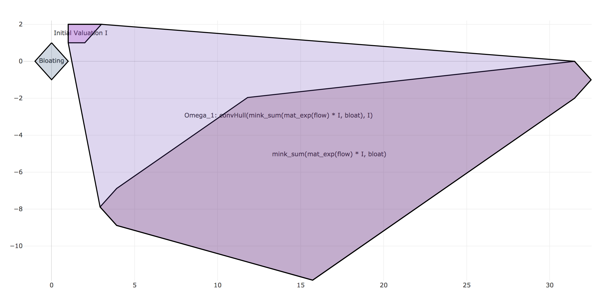

# flowp

Afternoon project that approximates and plots flow pipes for linear hybrid automata. Very unoptimal in the sense that this is restricted to 2D space and doesn't use any optimized libraries for polytope representations.

Nice to play around and explore basic flowpipe construction.

Please have a look at [this lecture](https://ths.rwth-aachen.de/wp-content/uploads/sites/4/teaching/vorlesung_hybride_systeme/ss2015/10b_LHA2_reachability.pdf) to get an idea of what's going on.

# Usage

`flowp` can be used like:

```python
import numpy as np
from flowp import approx

initial_location = [np.array(v) for v in [[1, 1], [2, 1], [3, 2], [1, 2]]]
flow = np.array([[1, 4], [-1, 3]])
bloating = [np.array(v) for v in [[0, 1], [1, 0], [-1, 0], [0, -1]]]

polytopes = approx(initial_location, flow, bloating, plot=True)  # Opens plot in standard browser.
```

The above code will produce the following plot:



One can optionally pass the argument `step_size`, which changes the standard step size from `1` to any desired value.

# Setup

If you have problems installing dependencies/setting this up to work, you can use `poetry` dependency management. Just run:

```
> poetry install
> cd src
> poetry run ipython
```

This will use the provided lock file to install all dependencies and then run a virtual env python environment, in which you can execute the above code.

Subsitute `ipython` by your prefered python environment or execute code using `flowp` or whatever.
